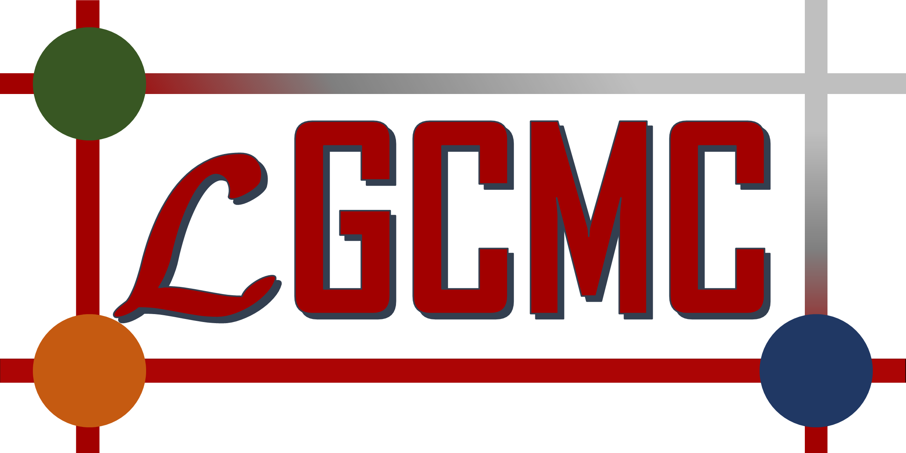

# LGCMC Code Repository

Welcome to **LGCMC** - A FORTRAN package for Lattice Grand Canonical Monte Carlo Simulation for *ab initio* prediction of pure and mixed gas isotherms.

## Introduction to LGCMC

### Grand Canonical Monte Carlo (GCMC) Simulation 
A grand canonical Monte Carlo simulates adsorption isotherms of pure 
and mixture of gases within a porous material. 
This approach imposes the condition of material equilibrium, i.e., the chemical 
potential of a species is equal in both gas and adsorbed phase. 
Usually simulation cells containing thousands of atoms are required and 
these are only feasible with force fields, which are often not adequate 
to describe the interatomic interactions. 
Sometimes, refitting force field parameters using *ab initio* calculations 
improves the interatomic descriptions but yet these refitted forcefileds are 
limited by the form of the adopted interatomic potential.
An alternative to force field fitting is to map the atomic degrees of
freedom of the adsorbate surface onto a coarse-grained description of 
adsorption sites. Such mapping can be made to utilize accurate *ab initio* 
energies using high-level quantum chemical methods 
such as coupled cluster theory. 
After coarse-graining, a GCMC simulation can be performed on
this coarse-grained model. **LGCMC** performs such kind of GCMC simulations on a
coarse-grained model to simulate pure and mixed gas adsorption isotherms. 
In this way it is possible to treat adsorbate-adsorbate lateral interactions 
explicitely, and thus, isotherm calculations can be performed avoiding 
any approximations, such as mean-field approximation.     

### Theoretical Background 

LGCMC employs the Lattice-Gas model as a coarse-grained Hamiltonian:

```math
 H({\bf n_{1},n_{2},...,n_{M}}) = \sum_{s=1}^M\sum_{c=A}^K\Delta G_{s}^{c}n_{i}^{c} + 
 \frac{1}{2} \sum_{s \neq s'} \sum_{c,c'=A}^K E_{s,s'}^{c,c'} 
n_{s}^{c}n_{s'}^{c'} + ... 
```
to define the adsorption free energies of a multi-component 
adsorption equilibria. 
Here, $s,s'=1,2,...,M$ denote the indices of adsorption sites within the 
simulation box, where $M$ is the maximum number of available sites. 
The indices $c,c'=A,B,...,K$ represent the gas species of a multi-component gas 
mixture. The Gibbs free energy of adsorption $(G_{s}^{c})$ of component $c$ 
on an isolated site $s$, and lateral interaction energies ($E_{s,s'}^{c,c'}$) 
of components $c$ and $c'$ adsorbed at sites $s$ and $s'$, respectively, 
can be computed applying accurate quantum chemical methods. The occupancy number
of the $c$-th species at the $s$-th site, $n_{s}^{c}$, is related to the 
total occupancy vector, ${\bf n_{s}}$, according to:

```math
\sum_{c=A}^{K} n_{s}^{c} = n_{s},
```
where $n_{s}$ denotes the magnitude of the vector.
An adsorption site can be occupied by atmost one gas molecule; so, both 
$n_{s}^{c}$ and $n_{s}$ can have only two allowed values: 0 and 1.  

The number of gas molecules of species $c$ at a specific configuration $i$ is:
```math
N_{c,i}=\sum_{s=1}^{M} n_{s}^{c}
``` 
LGCMC generates sample configurations: $i=1,2,3,...,I$, using a grand canonical 
Monte Carlo simulation scheme where chemical potential of each species is same in both gas and solid phase, *i.e.*, $\mu_{c}^{ads} = \mu_{c}^{gas}$. 
The condition of materials equilibrium dictates that the gas phase chemical 
potential, $\mu_{c}^{gas} = f(y,P,T)$, which is a thermodynamic function 
of pressure $(P)$, temperature $(T)$, and gas phase composition $(y)$, 
uniquely defines the adsorbed phase chemical potential as well. 
The chemical potential can be computed employing a suitable equation of state or
from the experimentally measured fugacity coefficients: 
$\phi_{c}=e^{\frac{\mu_{c}}{RT}}$ with $R$ denoting the universal gas constant.  The following equation of states: (i) ideal, (ii) Van der Waals, (iii) Redlich-Kwong, (iv) Soave-Redlich-Kwong, (v) Peng-Robinson (with 1978 and 1980's 
modifications), (vi) Peng-Robinson-Gasem equation of states are implemented. 
It is also possible to supply the fugacity coefficients (if known from
 experiments) to LGCMC.

After generating $I$ configurations, the surface coverage of component $c$ is 
defined as:
```math
\theta_{c}=\frac{\langle N_{c} \rangle}{M} = \frac{1}{MI}\sum_{i=1}^{I}N_{c,i} 
``` 
**LGCMC** prints surface coverages $(\theta_{c})$ after completion of a simulation. 

Please consult references [x] and [x] for more details. If you used LGCMC for 
 
### References


## Installation
**Requirements:** Intel fortran compiler.
To compile,
(1) Change install.sh to an executable by chmod 755 install.sh.
(2) Load intel fortran compiler by "module load <compiler version>".
(3) Run install.sh using ./install.sh

Manual is comming soon.
